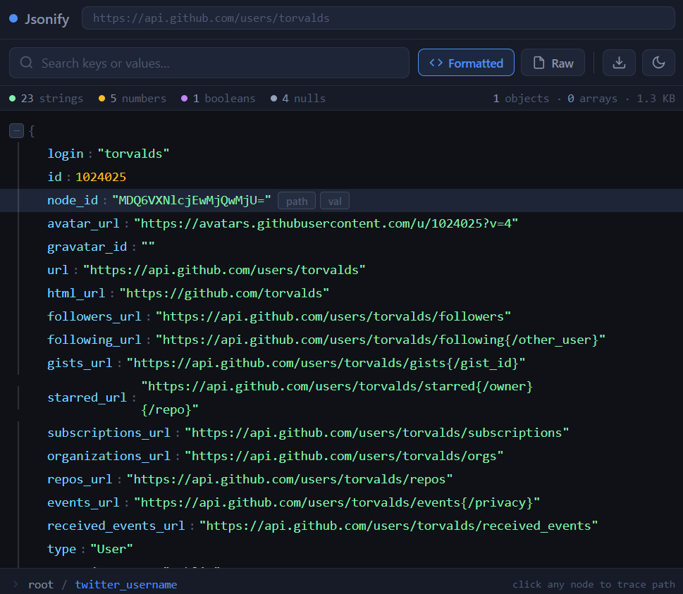

<div align="center">


# Jsonify

**The Chrome extension that makes JSON actually readable.**

Live search · Virtual rendering · Stringified JSON detection · Zero dependencies

[](LICENSE)
[](https://developer.chrome.com/docs/extensions/mv3/intro/)
[](#stack)
[](#stack)
[](https://github.com/Abideen-program/jsonify/pulls)

</div>

---

## The problem

Every developer has hit this wall:

```
{"login":"torvalds","id":1024025,"node_id":"MDQ6VXNlcjEwMjQ...","avatar_url":"https://avatars.githubusercontent.com/u/1024025?v=4","type":"User","site_admin":false,"name":"Linus Torvalds","company":"Linux Foundation","followers":243817,"following":0,"hireable":null}
```

Raw JSON in the browser is unreadable. Existing viewers either freeze on large files, have no search, or look like they were built in 2012.

**Jsonify fixes all three.**

---

## What it looks like

> **Before** — raw text wall in the browser

```json
{"login":"torvalds","id":1024025,"followers":243817,"hireable":null}
```

> **After** — Jsonify takes over the tab



## Features

### ⚡ Virtual rendering — never freezes
Every other free extension chokes on large API responses. Jsonify only renders what's visible in the viewport — everything else is lazy-loaded. Handles **50MB+ JSON** without breaking a sweat.

### 🔍 Live search with tree filtering
Type a key or value — the tree collapses to matching nodes in real time with highlighted matches. No button press, no waiting. **No other free extension does this.**

### 🧩 Auto-detect stringified JSON
APIs often return escaped JSON strings as values:
```json
{ "metadata": "{\"version\":2,\"flags\":[\"debug\",\"beta\"]}" }
```
Jsonify detects these automatically and shows an **expand ↗** badge. One click renders the nested JSON as a full inline sub-tree.

### 🖱️ Click-to-copy dot-path
Hover any node and copy its full dot-notation path instantly:
```
root.user.address.city   ← copied to clipboard
```
Saves developers from manually tracing deeply nested objects.

### 🌓 Dark / light theme
Reads your OS preference automatically. Override it anytime in the popup or toolbar.

### 📊 Stats bar
Instantly shows type breakdown — strings, numbers, booleans — and file size. No more guessing what's in the response.

### 🍞 Breadcrumb navigation
Always shows the path of the last node you clicked. Never lose your place in a large structure again.

---

## Quick start

**Install from Chrome Web Store** *(coming soon)*

**Or load locally in 30 seconds:**

```bash
git clone https://github.com/Abideen-program/jsonify.git
```

1. Open Chrome → go to `chrome://extensions`
2. Enable **Developer mode** (top-right toggle)
3. Click **Load unpacked** → select the `jsonify/` folder
4. Visit any JSON URL:

```
https://api.github.com/users/torvalds
```

That's it. No npm install. No build step. No config.

---

## Test URLs

| URL | What it tests |
|-----|---------------|
| `https://api.github.com/users/torvalds` | Basic tree rendering |
| `https://jsonplaceholder.typicode.com/posts` | Array rendering |
| `https://jsonplaceholder.typicode.com/users` | Nested objects |
| `https://api.github.com/repos/torvalds/linux` | Mixed types |
| Local `test.json` with stringified values | Expand ↗ badge |

---

## Architecture

Zero dependencies. Six files. A recruiter can open this and understand the whole codebase in 10 minutes.

```
jsonify/
├── manifest.json        # Manifest V3 config — permissions, content scripts
├── popup.html / .js     # Settings UI — theme, block list, toggles
├── icons/               # Extension icons (16, 48, 128px)
└── src/
    ├── detector.js      # Runs on every page — sniffs JSON content-type & text
    ├── renderer.js      # Core engine — virtual tree, search, stringified detection
    ├── toolbar.js       # UI chrome — search bar, stats bar, breadcrumb
    ├── main.js          # Orchestrator — mounts UI, handles all events, manages state
    └── theme.css        # Full dark + light system via CSS custom properties
```

**How it works end to end:**

```
Page loads
    ↓
detector.js  →  Is this JSON? (content-type or text sniff)
    ↓ yes
main.js      →  Replace page body with Jsonify UI
    ↓
renderer.js  →  Flatten JSON into row array → virtual render visible rows
    ↓
toolbar.js   →  Mount search bar, stats bar, breadcrumb
    ↓
User types   →  Live filter rows → re-render matching subtree
User clicks  →  Copy path / collapse node / expand stringified JSON
```

---

## Stack

| | |
|---|---|
| **Language** | Vanilla JavaScript (ES2020) |
| **Styling** | CSS custom properties — full dark/light theming with zero JS |
| **Extension API** | Chrome Manifest V3 — content scripts, storage API |
| **Rendering** | Custom virtual scroll — only visible DOM nodes rendered |
| **Dependencies** | **Zero** |
| **Build step** | **None** |
| **Bundle size** | < 25KB total |

---

## Roadmap

- [x] **v1.0** — Virtual rendering, live search, stringified JSON expand, copy path, dark/light theme, stats bar, breadcrumb
- [ ] **v1.1** — Inline value editing → copy modified JSON, response history (last 10)
- [ ] **v2.0** — YAML/XML import, JSON diff view, shareable links

---

## Contributing

Pull requests are welcome. For major changes, open an issue first.

```bash
git clone https://github.com/Abideen-program/jsonify.git
# Make your changes
# Load unpacked in Chrome and test
# Open a PR
```

---

## License

[MIT](LICENSE) — free to use, fork, and build on.

---

<div align="center">

Built with 🖤 by <a href="https://github.com/Abideen-program">Abideen</a>

If this saved you time, consider giving it a ⭐

</div>
